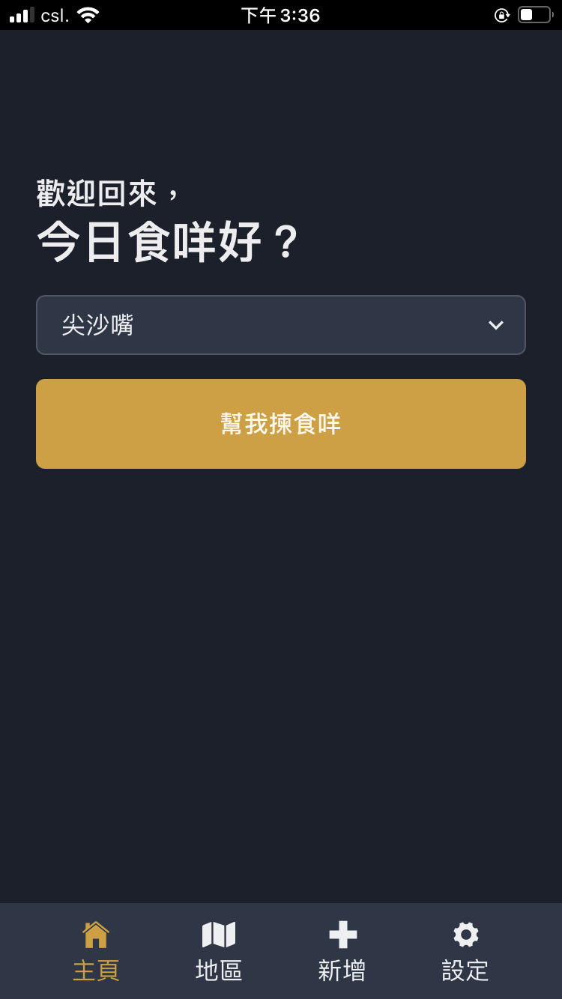
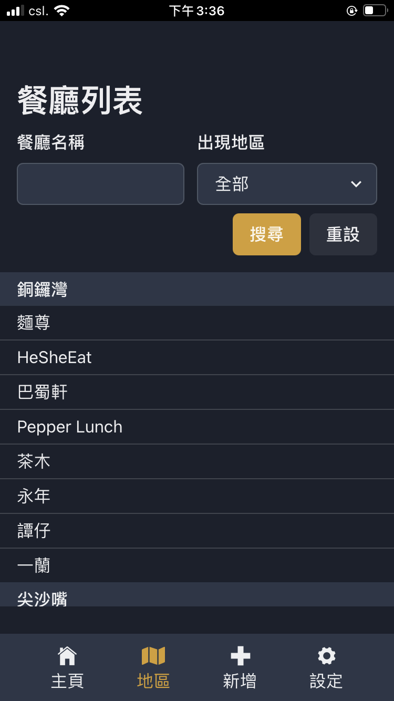
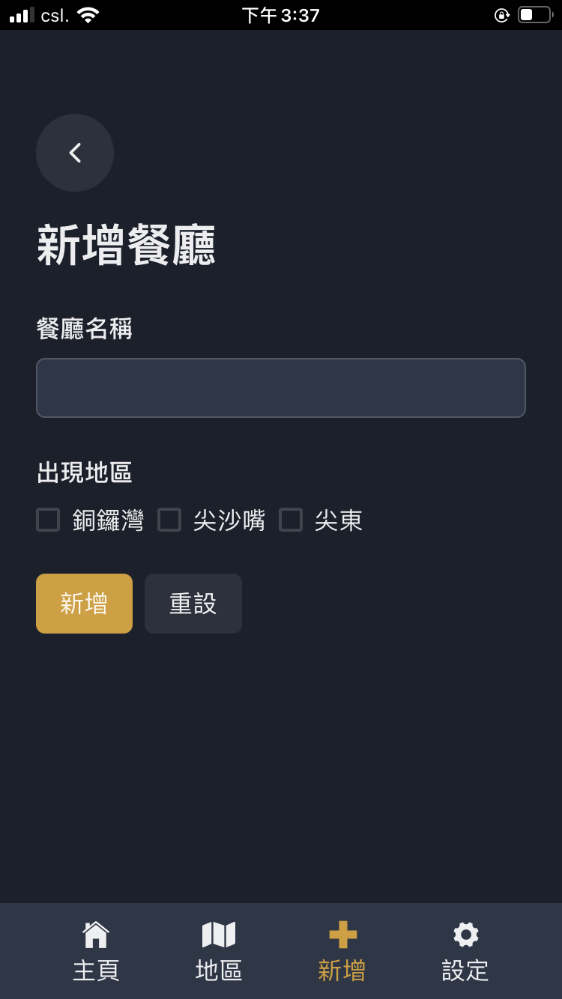
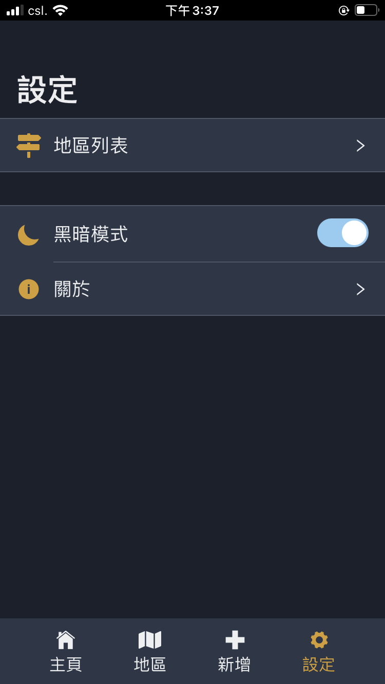
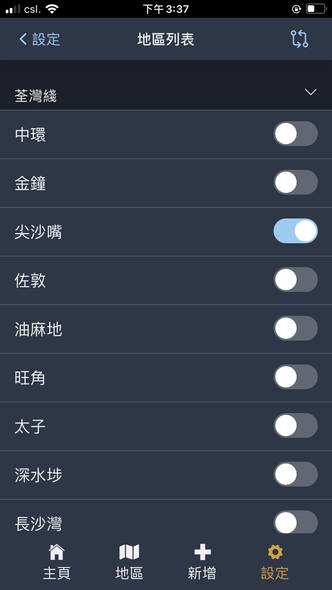
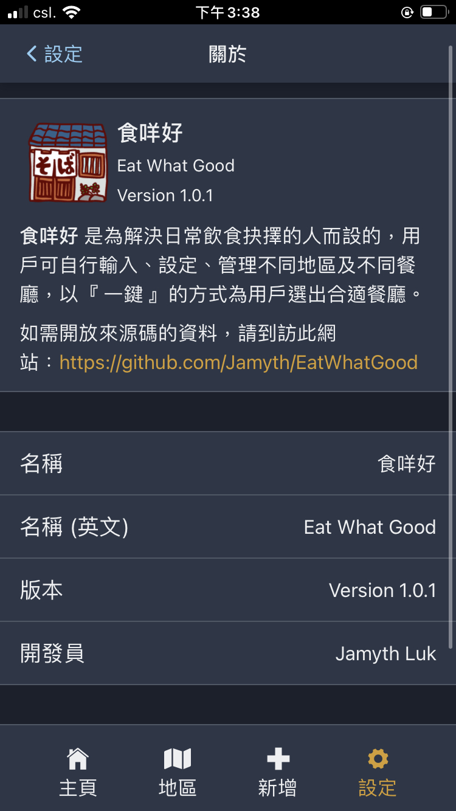

# **Eat What Good 食咩好**

Since my wife claims that she has 50% trouble every day from choosing a restaurant for her Lunch, so she asked me for this application.

Well, I installed this application on her phone twice.

Feature:

-   PWA
-   No Network Connection required after installation
-   Made in HK
-   With self-made ReactJS Framework and utility libraries
-   Chakra-ui
-   RecoilJS
-   Complete HK MTR Station list

Link: [Eat What Good](https://eatwhatgood.jamyth.com)

## **DEMO**

